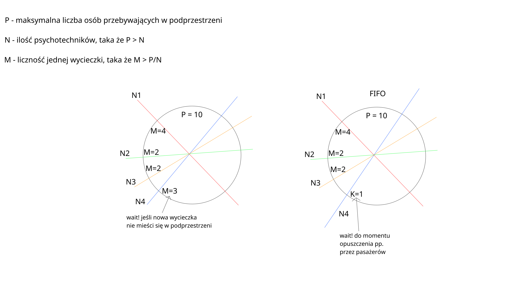

# distributed-wormholes

W innej galaktyce podróże międzyplanetarne odbywają się poprzez skorzystanie z usług psychokinetyków. Psychokinetyk może przenieść dowolną liczbę osób otwierając tunel w podprzestrzeni. Podprzestrzeń niestety może naraz pomieścić tylko ograniczoną liczbę P osób. Do psychokinetyka zgłaszają się wycieczki, każda o innej liczbie osób, od 0 do M. Dodatkowo, czasami zgłaszają się specjalni kurierzy. Występują następujące ograniczenia:

- Jest N psychotechników, każdy z nich losowo otrzymuje zgłoszenia pojawienia się losowej liczby pasażerów (max. M) albo kuriera.
 
- Podprzestrzeń naraz może pomieścić P osób, P >N, P < M*N
    
- Kurier zajmuje tyle miejsca, co jedna osoba

- Kurier zanim wyruszy, nie może przed nim być w podprzestrzeni ani jednego psychotechnika z pasażerami, chociaż mogą być przed nim inni kurierzy. Pasażerowie mogą się pojawić w podprzestrzeni, jeżeli już są tam kurierzy

- Nowe zgłoszenie pojawia się u psychotechnika dopiero po obsłużeniu poprzedniego. Należy zapewnić FIFO w tunelach

Należy zapewnić, by żaden rodzaj (np. kurierów) nie zmonopolizował podprzestrzeni, a więc by każde zgłoszenie do psychotechnika zostało ostatecznie obsłużone. Kurierzy zjawiają się rzadziej niż pasażerowie.

 

Opis algorytmu, według którego został zrealizowany projekt, znajduje się w pliku algorytm.pdf
